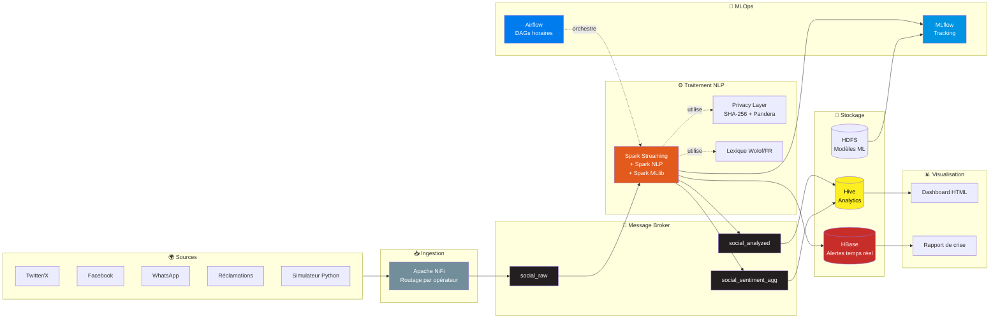
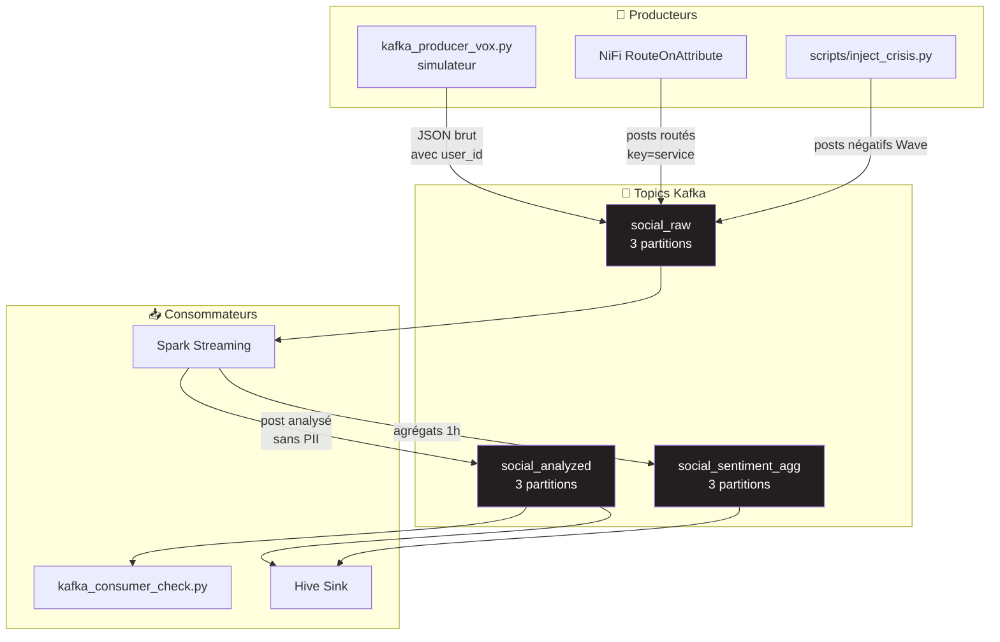
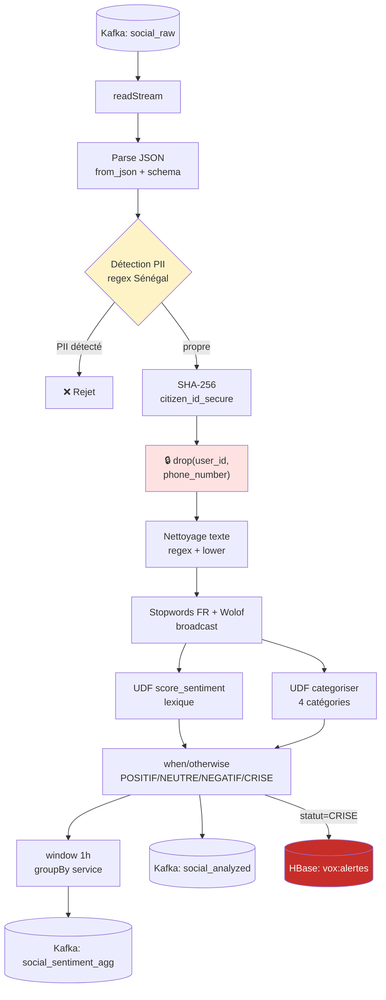
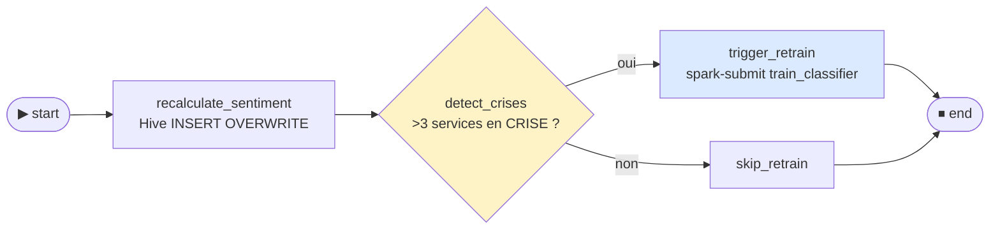
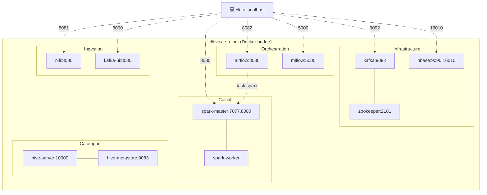
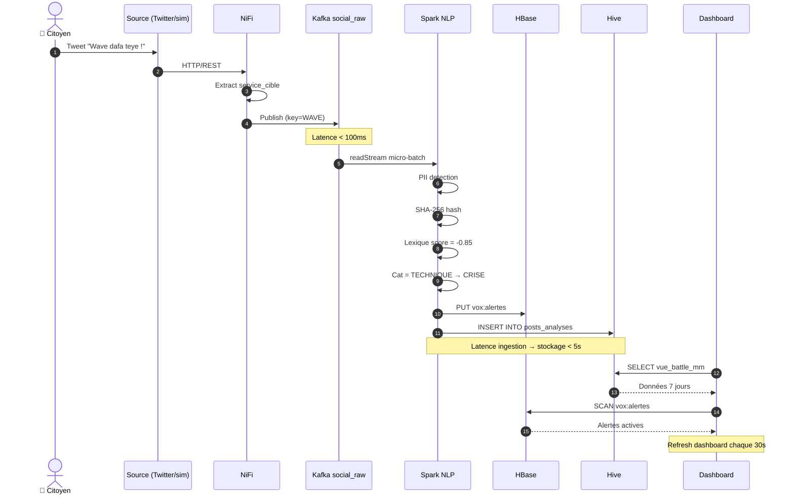
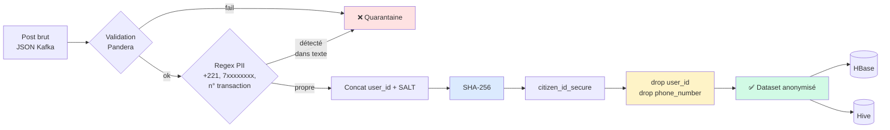

# 📐 Diagrammes d'Architecture Vox-SN

Tous les diagrammes utilisent la syntaxe **Mermaid**.
Rendu en ligne via https://mermaid.live ou intégrés à GitHub README.

---

## 1. Architecture Globale



---

## 2. Flux Kafka Détaillé



---

## 3. Pipeline Spark NLP Étape par Étape



---

## 4. DAG Airflow de Monitoring



---

## 5. Architecture Docker (réseau)



---

## 6. Flux de données complet (timing)



---

## 7. Privacy Layer en profondeur



---

## Comment exporter en image

### Option 1 : mermaid.live (web)
1. Coller le code Mermaid sur https://mermaid.live
2. Bouton **PNG** ou **SVG** → télécharger

### Option 2 : CLI mermaid-cli
```bash
npm install -g @mermaid-js/mermaid-cli
mmdc -i ARCHITECTURE.md -o docs/diagrams/architecture.png
```

### Option 3 : VS Code
Installer l'extension **Markdown Preview Mermaid Support** → preview rend les diagrammes.
